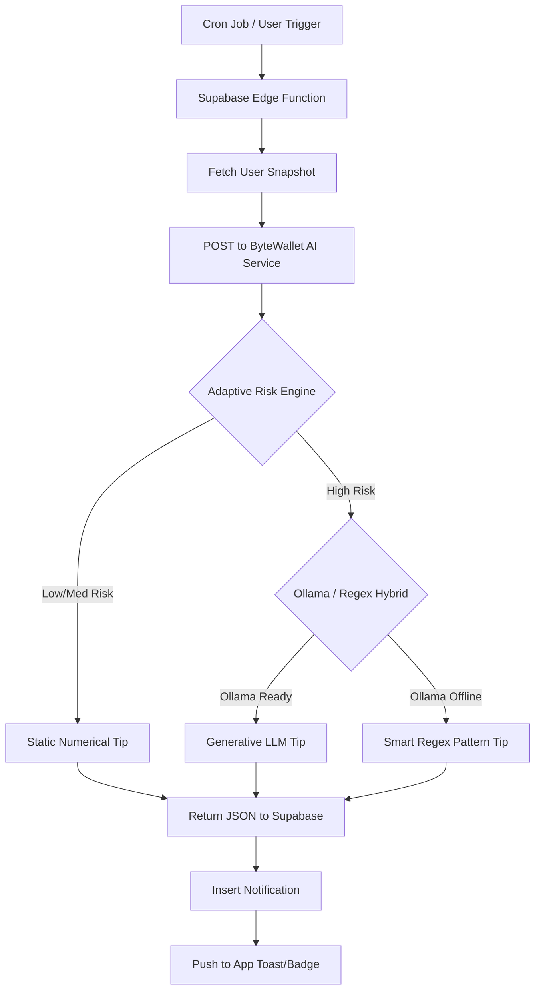

# 🧠 ByteWallet AI: Predictive "Burn Rate" Alerts
## Final Engineering Specification (v2.0)

The **Predictive Burn Rate Alert** is a proactive AI feature designed to shift financial tracking from *retrospective* (what you spent) to *prospective* (what you will have).

---

## 🎯 Goal
To warn users via local intelligence if their current spending velocity—adjusted for individual balance and upcoming income—will cause them to fall short of essentials or exceed their personal budget.

---

## 🏗️ System Architecture (100% Local Hybrid)

---

## 🛠️ Step-by-Step Flow

### 1. Data Collection Phase
The system fetches a "Snapshot" of the user's financial health:
- **Transactions**: Baseline + Current month.
- **Wallet Status**: Real-time Banking and Cash balances.
- **Monthly Budget**: User-defined limits.
- **Fixed Obligations**: Automated recurrence detection (Rent, Bills).

### 2. The Adaptive Risk Engine (FastAPI)
Logic executed in the **ByteWallet AI Microservice**:
- **Daily Burn Rate (DBR)**: `Total Spent Current Month / Day of Month`.
- **Projected Spend**: `DBR * (Remaining Days)`.
- **Internal Income Detection**: Automatically identifies historical `Salary` patterns.
- **Projected Month-End Balance**: `(Current Balance + Projected Income) - (Remaining Spend + Obligations)`.
- **ML Probability**: A `GradientBoostingClassifier` evaluates 19 behavioral features (Pacing, Impulse, Recurrence) to predict shortfall probability.

### 3. Smart Messaging (Adaptive Voice)
If the **Risk Engine** detects a concern:
- **Priority 1 (Ollama)**: Findings are sent to a local LLM (`qwen2.5`) for a human-readable coaching message.
- **Priority 2 (Adaptive Regex)**: If Ollama is offline, a regex-driven pattern engine identifies specific spending (e.g., "Starbucks", "Grab") to provide instant, personalized advice locally.

### 4. Insight Generation (Sample Result)
> **AI Result**: "Hey Ku Kue, you're projected to have 4.5M VND left at month-end, but your 'Cafe' spending is trending 30% higher than last month. Should we cut back on Starbucks visits this week to keep your rent buffer safe?"

---

## 📊 Logic Example (The Adaptive Approach)

| Variable | Value |
| :--- | :--- |
| **Current Date** | 15th (50% through month) |
| **Spent to Date** | 4,550,000 VND |
| **Current Balance** | 500,000 VND |
| **Projected Income** | 8,000,000 VND (Salary expected) |
| **Obligations** | 3,000,000 VND (Rent) |
| **Calculated Outcome**| **4.7M VND Surplus** (**Risk: LOW**) |

*Note: In v1.0, this would have been "High Risk" due to low balance. In v2.0 Adaptive AI, the system knows the user is safe.*

---

## 🔒 Security & Privacy (100% Offline)
- **Local Processing**: All AI math and Voice generation occurs on-device or on the user's local server. No data leaves the hardware.
- **Privacy First**: Zero external API dependencies (Gemini removed).
- **Federated Ready**: Built-in logic for Phase 5 Federated Learning to update models without raw data sharing.

---

**ByteWallet AI Innovation v2.0**
*Empowering financial foresight through adaptive, privacy-first intelligence.*
