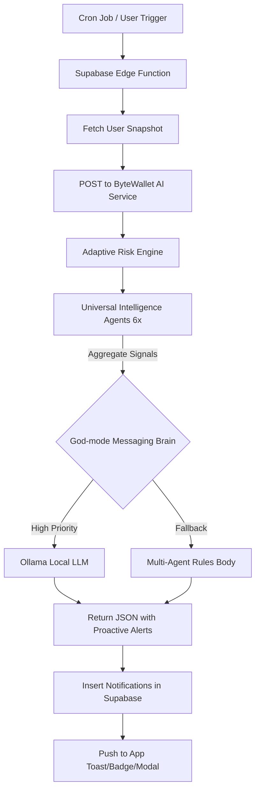

# 🧠 ByteWallet AI: Predictive "Burn Rate" Alerts
## Final Engineering Specification (v2.1)

The **Predictive Burn Rate Alert** is a proactive AI feature designed to shift financial tracking from *retrospective* (what you spent) to *prospective* (what you will have).

---

## 🎯 Goal
To warn users via local intelligence if their current spending velocity—adjusted for individual balance and upcoming income—will cause them to fall short of essentials or exceed their personal budget.

---

## 🏗️ System Architecture (100% Local Hybrid)

---

## 🛠️ Step-by-Step Flow

### 1. Data Collection Phase
The system fetches a "Snapshot" of the user's financial health:
- **Transactions**: Baseline + Current month.
- **Wallet Status**: Real-time Banking and Cash balances.
- **Monthly Budget**: User-defined limits (Dynamic, no hardcoded defaults).
- **Fixed Obligations**: Automated recurrence detection + Explicit user bills.
- **Savings Goals**: Target amounts and deadlines (NEW).

### 2. Multi-Agent Intelligence (Phase 4.5)
The **ByteWallet AI Microservice** now orchestrates 6 autonomous agents:
1.  **Liquidity Agent**: Compares (Balance - 30d Extra) vs Essential Bills (Condition-1).
2.  **Income Agent**: Detects late salaries or significant gig-earnings drops.
3.  **Goal Agent**: Tracks pacing toward user-defined savings targets.
4.  **Anomaly Agent**: Flags unusual spikes or duplicate transactions.
5.  **Subscription Agent**: Monitors price hikes in recurring services.
6.  **Savings Agent**: Nudges users to move idle cash into yield-bearing accounts.

### 3. God-mode Coaching Brain
Logic executed in the **Messaging Service**:
- **Signal Aggregator**: Ranks all agent findings by **Life Impact Priority** (Liquidity > Security > Waste > Goals).
- **Consolidated Prompting**: Feeds the top 2 prioritized signals into the local Ollama LLM (`qwen2.5`) for a single, synthesized coaching tip.
- **Rules Fallback**: If LLM is offline, a deterministic engine provides the most urgent agent's message + suggested action.

---

## 📊 Logic Example (Universal Intelligence)

| Agent | Signal | Actionable Coaching |
| :--- | :--- | :--- |
| **Liquidity** | Bill shortfall of 800k VND | "You need 800k more for rent. Cut 4 Cafe visits to cover this." |
| **Income** | Salary is 10 days late | "Your salary is late. Tighten your budget to stay safe." |
| **Goal** | 85% toward 'New Bike' | "Almost there! Just 1.5M VND more to hit your bike goal." |

---

## 🔒 Security & Privacy (100% Offline)
- **Local Summarization**: All synthesis occurs on the user's hardware.
- **Privacy First**: Zero external API dependencies.
- **Federated Ready**: Built-in logic for Phase 5 Federated Learning to update models without raw data sharing.

---

**ByteWallet AI Innovation v2.1**
*Empowering financial foresight through universal, multi-agent intelligence.*
