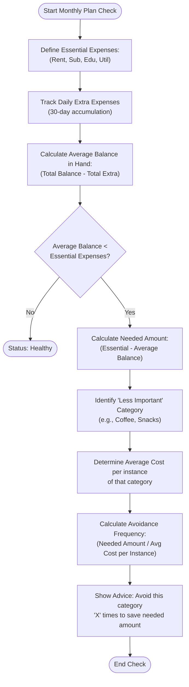

# Condition 1: Monthly Plan Shortfall Analysis (Enhanced)

This document outlines the detailed logic for detecting financial shortfalls caused by daily extra expenses and calculating the necessary behavioral corrections to cover essential costs.

## Core Formulae

### 1. Essential Expenses
Fixed monthly obligations paid at the end of the month.
- **Components**: Rent, Subscriptions, Education, Utilities.
- **Formula**: `Essential_Expenses = Rent + Sub + Edu + Util`

### 2. Average Balance in Hand
The projected residual funds after persistent daily discretionary spending.
- **Calculation**: Includes all "extra" daily spending accumulated over the 30-day period.
- **Formula**: `Average_Balance_in_Hand = Total_Balance - Total_Extra_Expenses_Monthly`

## The Shortfall Condition

A shortfall is identified if the average funds remaining do not meet the total fixed obligations.

**Condition**:
IF **Average_Balance_in_Hand < Essential_Expenses**:
1. Calculate **Needed Amount**: `Essential_Expenses - Average_Balance_in_Hand`.
2. Action: **Find a "Less Important" expense category (e.g., Snacks, Coffee, etc.).**
3. Calculate **Avoidance Frequency**:
   - `Average_Cost_per_Instance = Total_Category_Spend / Number_of_Instances`
   - `Times_to_Avoid = Needed_Amount / Average_Cost_per_Instance`

---

## Flowchart

