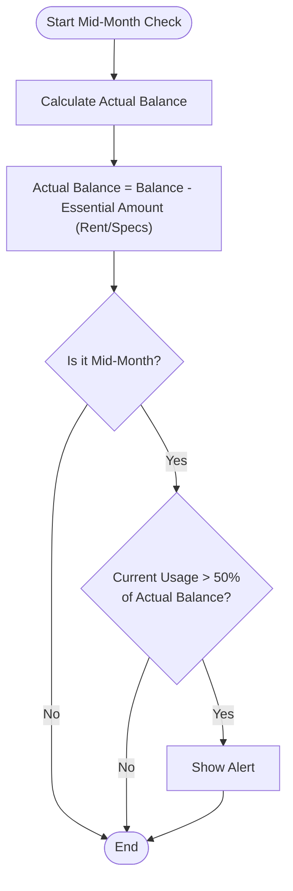

# Condition 2: Mid-Month Check

This document outlines the logic for the mid-month financial check based on the "Actual Balance" formula.

## Formula

The **Actual Balance** is defined as the total balance available after subtracting essential regular payments.

$$Actual\ Balance = Total\ Balance - Essential\ Amount$$

### Key Terms:
- **Essential Amount**: Regular recurring payments such as rent, subscriptions, bills, etc.
- **Actual Balance**: Discretionary funds available for the month (set as the 100% baseline).

## Condition Logic

An alert is triggered in the middle of the month based on the usage of the Actual Balance.

**Rule**:
If **(Mid-Month)** AND **(Current Balance > 50% of Actual Balance)**, then **Show Alert**.

> [!NOTE]
> Interpretation: In this context, "Current Balance > 50%" likely refers to the **spent/used amount** or a threshold indicating that more than half of the discretionary funds have been consumed by the midpoint of the month.

## Flowchart

